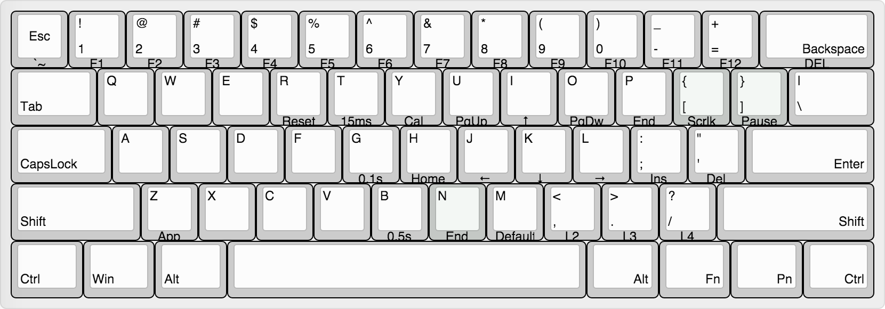
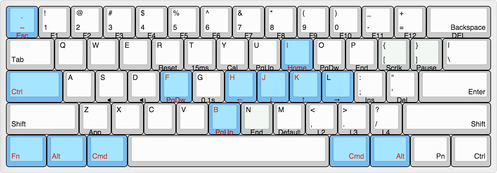
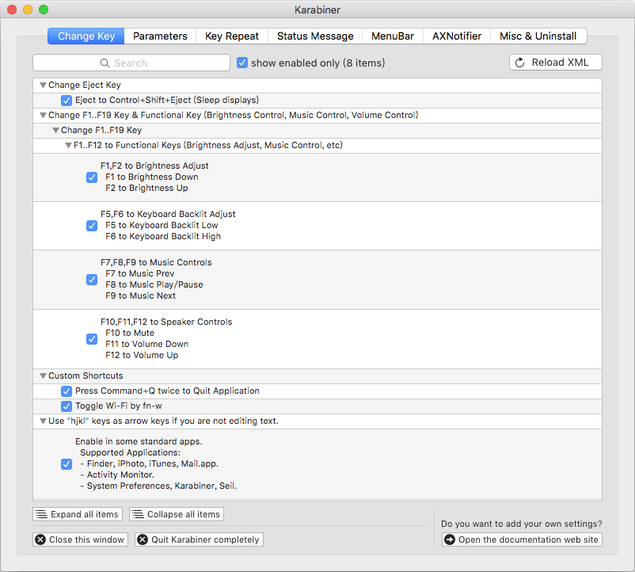

# POK3R 针对 Mac 的键盘布局

如果你还不知道 POK3R 键盘的话，请看[评测](https://www.youtube.com/watch?v=8wjW-Or1jg8)。
对于国内目前的购买渠道请直接淘宝搜索 `poker 3 机械键盘` 或者进行海淘 [amazon](http://smile.amazon.com/Mechanical-Keyboard-Keycaps-Cherry-Mx-Blue/dp/B00OFM51L2/), [mechanicalkeyboards.com](https://mechanicalkeyboards.com/shop/index.php?l=product_detail&p=1233)

## 调教工具

- POK3R 键盘本身
- [Karabiner](https://github.com/tekezo/Karabiner)

## POK3R

### 键盘布局

[keyboard-layout-editor.com](http://www.keyboard-layout-editor.com/#/layouts/2b8de1b32edbc257d6585e6f5c5af248) 可编辑键盘布局的链接

### 编辑层分布：

- 默认层：无法进行编辑修改。使用 `FN + M` 切换
- 第二层：OS X 键位 (蓝灯常亮），使用 `FN + ,<` 切换
- 第三层：未设置 (红灯常亮），使用 `FN + .>` 切换
- 第四层：未设置 (红蓝灯，又称紫灯常亮），使用 `FN + /?` 切换

### POK3R 通用信息
- Vortex 网站的[POK3R 用户说明书](http://www.vortexgear.tw/db/upload/webdata4/vortex_20156296454697283.pdf)
- 恢复初始化: 按着左右键位的 `ALT` 键直到 LED 灯停止闪烁（大约 5 秒）
- 恢复当前编辑层: 按着 `FN + R` 键直到 LED 灯停止闪烁（大约 5 秒）

#### 键盘编程
- 默认层无法编程
- 按下 `FN + R_Ctrl` 进入编程模式，如果 `FN` 键已经分配使用 `L_Ctrl`键（空格键右侧的 LED 蓝灯常亮）
- 选中你要设置的`目标键` 再按下你要分配的`新键值` (最多可以编程 31 个键）最后按下 `PN` 进行确认保存 (按下目标键后灯会一直闪烁直到改键保存后恢复常亮)
- 重复上面步骤进行多次编程
- 退出编程模式按下 `FN + R_Ctrl` （空格右侧的 LED 蓝灯熄灭）

### OS X 键位布局
- `FN + ,<` 切换到第二编辑层
- [使用 L_Ctrl 替换 FN 键](#Move_FN)
- 按下 `FN + R_Ctrl` 进入编程模式
- [常规绑定](#common_bindings)
- 替换空格左右侧的 Cmd/Option 键:
  - L_Cmd: `L_Alt` -> `L_WIN` -> `PN`
  - L_Option: `L_WIN` -> `L_Alt` -> `PN`
  - R_CMD: `R_Alt` -> `R_FN` (Win) -> `PN`
  - R_Option: `R_FN` (Win) -> `R_Alt` -> `PN`
- `FN + R_Ctrl` 退出编程模式

可视化键盘布局如下:

[keyboard-layout-editor.com](http://www.keyboard-layout-editor.com/#/gists/adf444eabbc6f072c821) 可编辑键盘布局的链接

### 适用所有操作系统的常规绑定
- CapsLock 必须改为 Ctrl:
  - 依次按下 `CapsLock` -> `L_Ctrl` -> `PN`
  - `FN + CapsLock` -> `L_Ctrl` -> `PN`
- Esc 和 ` 互换：
  - `Esc` -> `FN + Esc` -> `PN`
  - `FN + Esc` -> `Esc` -> `PN`
- VIM 党的钟爱的 HJKL 和上下翻页:
  - 左: `FN + H` -> `FN + J` -> `PN`
  - 下: `FN + J` -> `FN + K` -> `PN`
  - 上: `FN + K` -> `FN + I` -> `PN`
  - 下一页: `FN + F` -> `FN + O` -> `PN`
  - 上一页: `FN + B` -> `FN + U` -> `PN`
- Home: `FN + I` -> `FN + H` -> `PN`
- 音量控制:
  - 静音: `FN + X` -> `FN + /?` -> `PN`
  - 减小音量: `FN + C` -> `FN + ,<` -> `PN`
  - 加大音量: `FN + V` -> `FN + .>` -> `PN`

### 使用 L_Ctrl 替换 FN 键
把 FN 键放到键盘左下角能够更好的使用 HJKL 作为方向键（用左手掌的边缘方便的按下）:
- 切换到需要设置的编辑层(2, 3, 4)，这个只是单个编辑层有效
- 拔掉键盘的 USB 连接线
- 把键盘背后的 DIP 4 切换到 ON
- 插上 USB 连接线，依次按下 `FN` -> `L_Ctrl` -> `PN` -> `PN` (仅修改 FN 键，PN 键保持不变)
- 最后把 DIP 4 恢复 OFF (无需再把 USB 连接线)

## Karabiner

自定义 [private.xml](karabiner/private.xml) 及以下可视化配置如下：

1. 按下 Eject 键机器睡眠（ Ctrl + Shift + Eject 组合键）
2. 影射 F1-12 功能键为 Mac 原生的功能
3. 按下两次 Cmd+ + Q 才会退出应用
4. FN + w 管理 WiFi 的开关
5. 在系统一些默认应用中非编辑模式使用 `hjkl` 当做方向键

## 参考来源

特别感谢 [davidjenni/pok3r-layouts](https://github.com/davidjenni/pok3r-layouts) 的布局教程，以上内容基于原文进行了部分的替换和中文化处理。相关参考：

- [r/mk: Pok3r wiki](https://www.reddit.com/r/MechanicalKeyboards/wiki/pok3r)
- [r/mk: HowTo program pok3r](http://www.reddit.com/r/MechanicalKeyboards/comments/35uy60/guide_howto_program_your_pok3r_programming_layers/)
- [r/mk: HowTo media controls pok3r](http://www.reddit.com/r/MechanicalKeyboards/comments/37j3sx/guide_modification_pok3r_media_volume_controls_hw/)

本文章基于[署名-相同方式共享 4.0 国际 CC BY-SA 4.0](http://creativecommons.org/licenses/by-sa/4.0/deed.zh) 协议发布。

